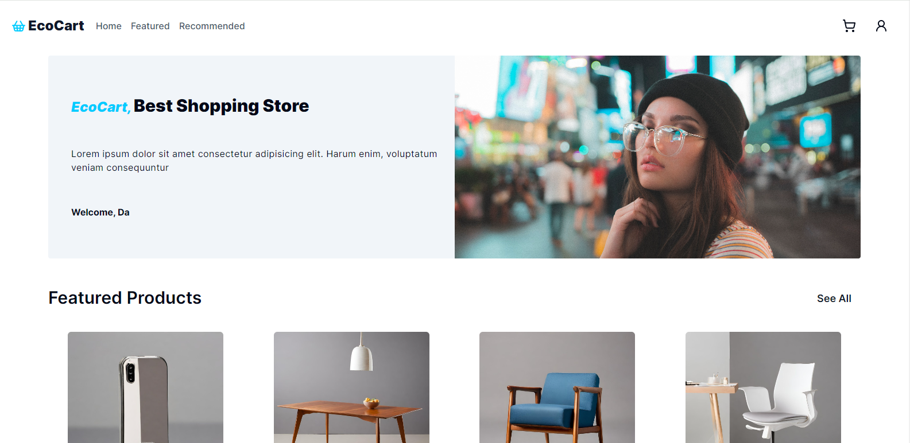
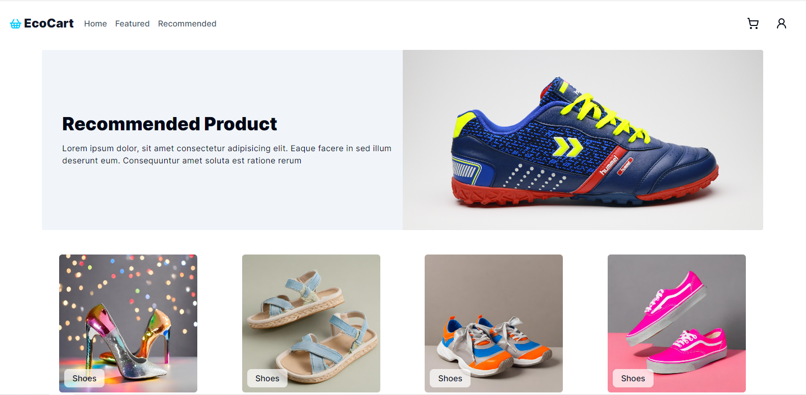
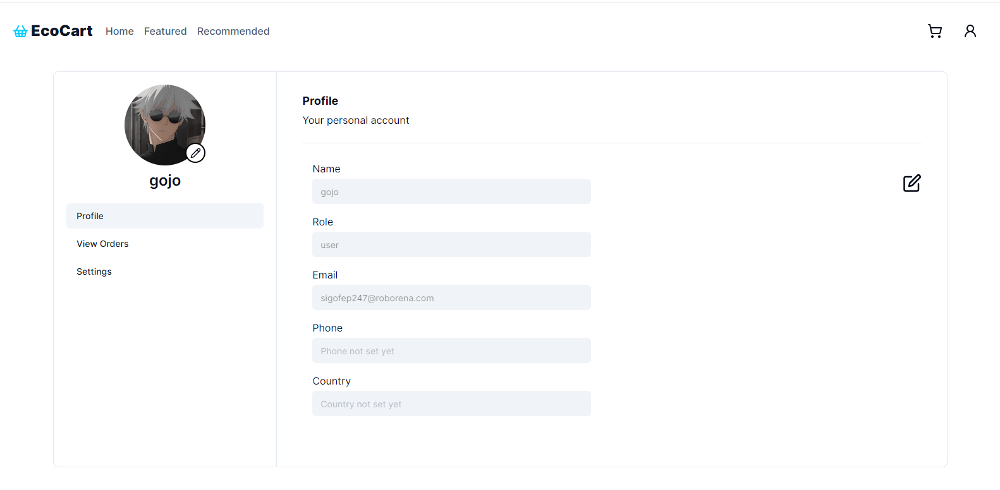
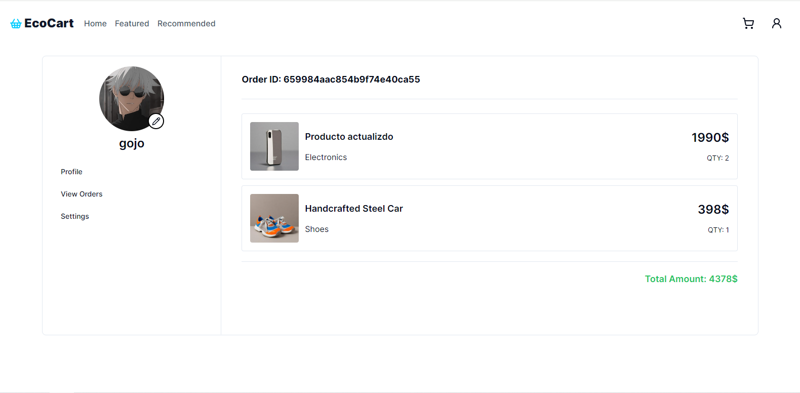

# Ecocart | E-commerce Mern Stack

Ecocart, a full-stack e-commerce application built using the MERN stack [Typescript]

## Table of contents

- [Features](#features)
- [Installation](#installation)
- [Run Locally](#run-locally)
- [Screenshots](#screenshots)

## Features

- **User Authentication:** Register and log in securely. Manage user accounts, including profile settings and password management.

- **Product Listings / Cart:** Explore all products, effortlessly manage the cart by adding, removing, or editing items.

- **Product Details:** Detailed information about products, including descriptions, images, and technical specifications.

- **Shopping Cart:** Effortlessly manage shopping carts, review and adjust items, calculate total prices, and proceed to checkout.

- **Checkout:** Process orders securely using stripe checkout.

- **Order History and Tracking:** Easily track and manage your purchase history, view detailed order information, and stay updated on the status of your deliveries and past transactions.

## Installation

### Prerequisites

Before running the project, make sure you have the following done:

- **You have Node.js installed (v18 or higher)**

- **Create a .env file in the root directory and add the necessary variable from .env.example in client and server**

### Run locally

1. Clone the repository:

   ```bash
   git clone https://github.com/yuzakki/ecocart-ecommerce-mern.git
   ```

2. Navigate to the project directory:

   ```bash
    cd ecocart-ecommerce-mern
   ```

3. Install dependencies:

   install the necessary dependencies in both client and server folders

   ```bash
   npm install
   ```

4. Start the client and server by same command:

   ```bash
   npm run dev
   ```

## Screenshots







